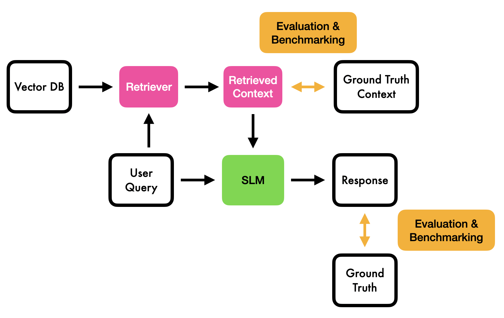

# Master_Thesis_RAG_Benchmarking

Master_Thesis_RAG_Benchmarking is a comprehensive benchmarking framework for Retrieval-Augmented Generation (RAG) systems. It evaluates multiple retrieval strategies and incorporates various generative models to assess performance across key metrics such as faithfulness, answer relevancy, and context precision.

## Table of Contents
- [Features](#features)
- [Directory Structure](#directory-structure)
- [Installation](#installation)
- [Usage](#usage)
- [Notebooks](#notebooks)
- [License](#license)

## Features
- **Retrieval Methods**  
  - Dense (using Chroma and OllamaEmbeddings)  
  - Sparse (using BM25)  
  - Hybrid (combining dense and sparse methods)
- **Generative Models**  
  - Deepseek-r1
  - Llama 3.2  
  - Other Ollama-compatible models
- **Evaluation Frameworks**  
  - **RAGAS:** Measures faithfulness, answer relevancy, context precision, and context recall.  
  - **RGB:** Evaluates noise robustness, integration, and factual correctness.
- **Local Model Integration**  
  - Call local models using Ollama for on-demand generation.
- **Interactive Experiments**  
  - Provided Jupyter notebooks for step-by-step experimentation.

## Directory Structure
- **benchmarks/**  
  - **Ragas/**: Contains the RAG benchmark pipeline (data loading, chain setup, retrieval, evaluation, and visualization).  
  - **RGB/**: Contains the local evaluation pipeline supporting noise and fact-checking experiments.
- **configs/**: Experiment configuration files.
- **data/**: Datasets, including test documents and QA pairs.
- **database/**: Retrieval databases (for example, Chroma and BM25 setups).
- **notebooks/**: Interactive notebooks (e.g., `Ragas_benchmark.ipynb`, `RGB_benchmark.ipynb`).
- **results/**: Generated outputs such as metrics, heatmaps, and prediction logs.
- **scripts/**: Core scripts and utilities for running benchmarks and evaluations.

## Installation
1. **Clone the repository:**
   ```bash
   git clone https://github.com/yourusername/Master_Thesis_RAG_Benchmarking.git
   cd Master_Thesis_RAG_Benchmarking
   ```

2. **Create and activate the Python virtual environment:**
   ```bash
   python -m venv venv
   source venv/bin/activate  # On Windows use: venv\Scripts\activate
   ```

3. **Install the dependencies:**
   ```bash
   pip install -r requirements.txt
   ```

4. **Install Ollama:**
   Follow the instructions at [ollama.com](https://ollama.com) to install Ollama on your system.

5. **Pull required models:**
   ```bash
   ollama pull deepseek-r1:1.5b
   ollama pull llama3.2:3b
   ollama pull nomic-embed-text  # for embeddings
   ```

6. **Configure your environment:**
   - Set up the environment variable for your OpenAI API key (needed for evaluations):
     ```bash
     export OPENAI_API_KEY="your_openai_api_key"
     ```
   - Alternatively, create a `.env` file with the necessary configuration.

## Usage
### RAG Benchmark Pipeline
Run the RAG pipeline to evaluate retrieval strategies combined with a generative model:
```bash
python -m benchmarks.Ragas.Ragas --ollama_model deepseek-r1:1.5b --retrieval_strategy hybrid
```

This script will:
- Load and split documents (from `data/Ragas/testContext.txt`)
- Set up dense, sparse, and hybrid retrievers
- Configure the RAG chain with the specified language model
- Evaluate QA pairs and output metrics with visualizations in the `results/Ragas/` folder

### RGB Benchmark Pipeline
Execute the RGB pipeline for local evaluation with customizable noise and fact-checking:
```bash
python -m benchmarks.RGB.RGB --ollama_model llama3.2:3b --dataset en --noise_rate 0.0
```

For fact-checking evaluation:
```bash
python -m benchmarks.RGB.fact_evalue --ollama_model llama3.2:3b --dataset en --noise_rate 0.0
```

For rejection capability evaluation:
```bash
python -m benchmarks.RGB.reject_evalue --ollama_model llama3.2:3b --dataset en
```

Additional options (like fact-checking and debug mode) are available. Use the `-h` flag to view all arguments.

## Notebooks
For an interactive exploration of the benchmarking process, check out:
- **Ragas_benchmark.ipynb**: Walkthrough of the RAG benchmark pipeline with visualization of metrics.
- **RGB_benchmark.ipynb**: Interactive setup and evaluation using local models with configurable noise rates.

## License
This project is licensed under the MIT License. See the [LICENSE](LICENSE) file for details.

---



Happy benchmarking!

